# Bijli Bachat – Smart Electricity Management System

## Overview

Bijli Bachat is a scalable smart electricity management platform developed to help Pakistani households monitor, analyze, and optimize electricity consumption in real time. The system addresses the challenges of tier-based electricity billing by providing users with consumption analytics, bill estimation, tariff alerts, appliance-level monitoring, and solar net-metering support through an interactive and user-centric interface.

The application was engineered using layered software architecture principles to ensure modularity, maintainability, and separation of concerns across business logic, data management, and user interface components.

---

## Problem Statement

Electricity billing in Pakistan follows a progressive tariff structure where higher energy consumption results in significantly increased per-unit pricing. Most households lack visibility into their real-time usage patterns and are unable to proactively manage consumption before entering higher billing tiers.

Bijli Bachat was designed to solve this problem by enabling:

- Real-time electricity consumption tracking
- Monthly bill estimation
- Appliance-level energy analysis
- Usage ceiling management
- Tariff threshold alerts
- Solar energy and net-metering monitoring

---

## Core Features

### User Features
- Secure user registration and authentication
- Real-time electricity usage tracking
- Estimated monthly bill calculation
- Appliance usage logging and monitoring
- Monthly consumption ceiling management
- Automated tariff tier alerts
- Billing history and analytics dashboard
- Solar net-metering support

### System Features
- Layered software architecture
- Modular DAO-based database interaction
- Configurable tariff management system
- Maintainable service-oriented business logic
- Interactive JavaFX user interface

---
## Application Screenshots

### Login Interface

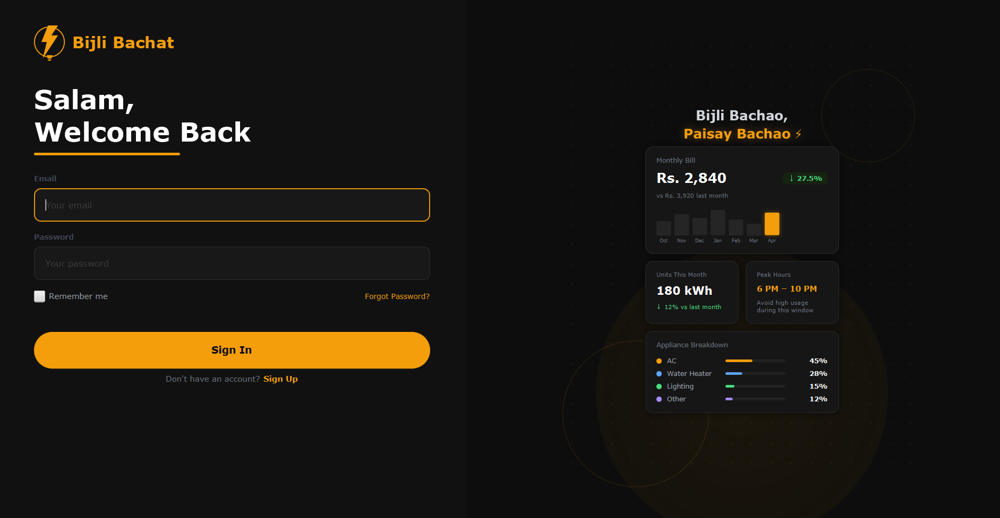

---

### Registration Interface

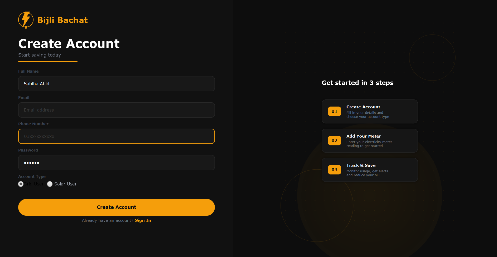

---

### Dashboard Overview

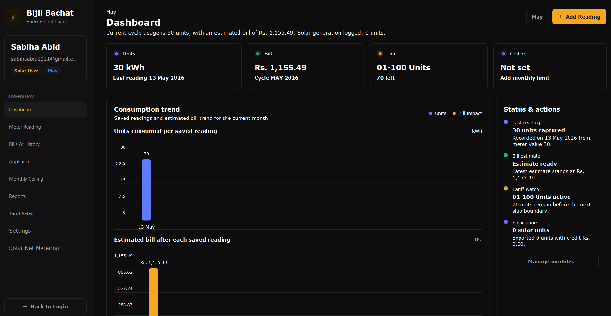

---

### Meter Reading Module

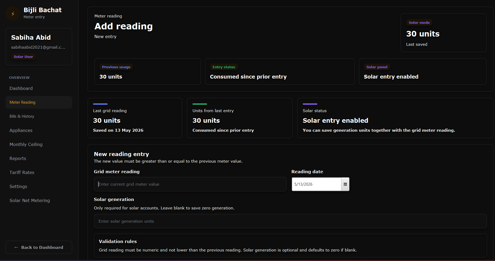

---

### Billing & History

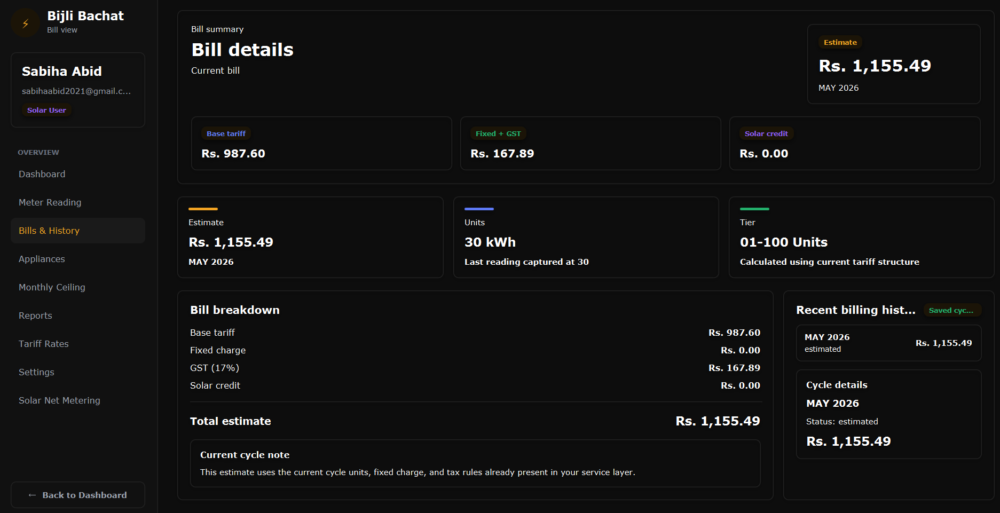

---

### Appliance Tracking System

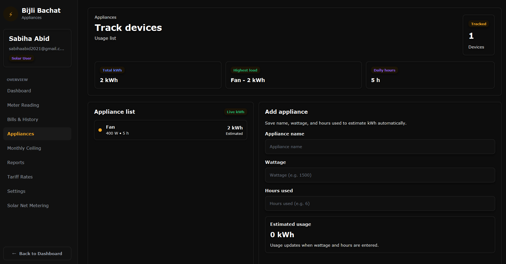

---

### Monthly Ceiling Management

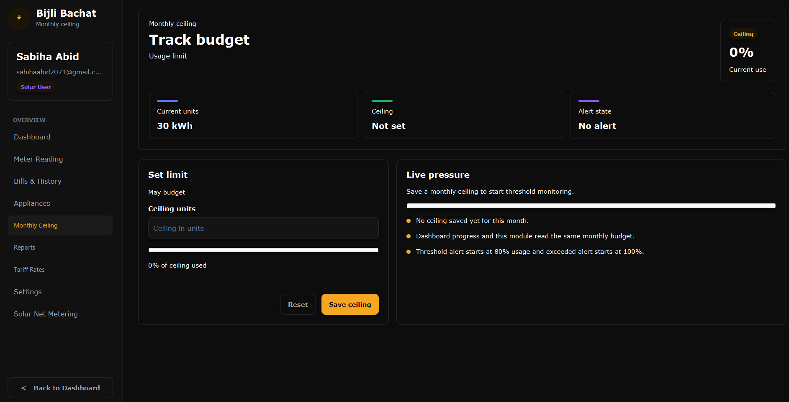

---

### Consumption Reports

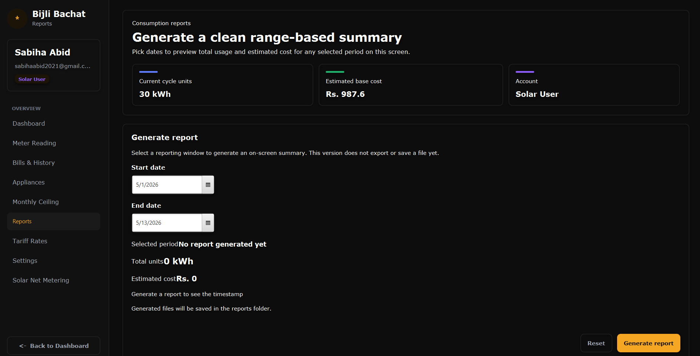

---

### Tariff Management System

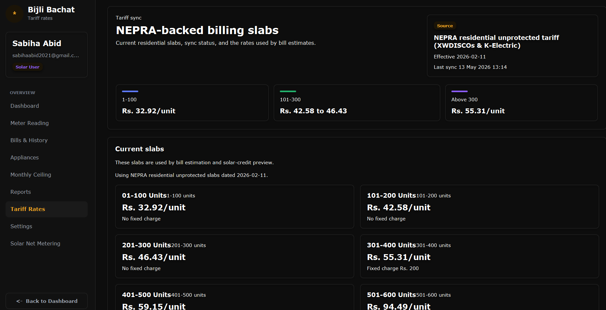

---

### Solar Net Metering

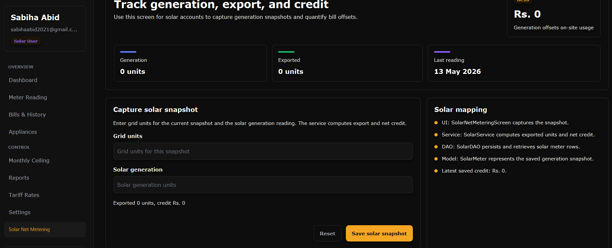

---

### Account & Settings Management

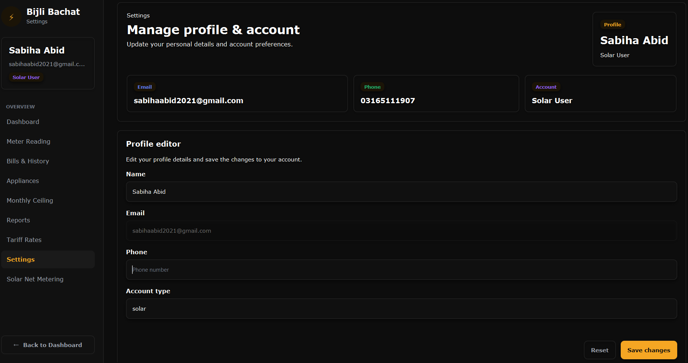

## Architecture & Design

The system follows a layered architecture model to improve scalability, maintainability, and extensibility.

### Architectural Layers

| Layer | Responsibility |
|---|---|
| `dao` | Database access and persistence handling |
| `model` | Core entities and domain models |
| `service` | Business logic and processing |
| `ui` | User interface and interaction |
| `resources` | Configuration files, FXML layouts, tariff data |

---

## Technologies Used

- Java
- JavaFX
- Maven
- FXML
- Object-Oriented Programming (OOP)
- Layered Software Architecture
- UML Modeling
- Software Design Principles

---

## Software Design and Analysis Concepts Applied

- Requirement Engineering
- Layered Architecture
- Object-Oriented Design
- UML Modeling
- Separation of Concerns
- Agile/Scrum Collaboration
- Modular System Design

---

## Project Structure

```text
src/main/java/com/example/bijlibachat/
├── dao/
├── model/
├── service/
├── ui/
├── HelloApplication.java
├── HelloController.java
└── Launcher.java
```

---

## Key Learning Outcomes

This project strengthened our practical understanding of:

- Scalable software architecture
- Modular application development
- Object-oriented system design
- Real-world problem solving
- JavaFX application development
- Database interaction patterns
- Team-based software engineering workflows

---

## Future Enhancements

- AI-powered consumption prediction
- Mobile application integration
- Smart meter API integration
- Cloud-based analytics
- Advanced energy optimization recommendations
- Multi-region tariff support

---

## Team Members

Developed collaboratively by:

- Sabiha Abid
- Sukaina Zainab
- Nauman Zafar

---

## License

This project was developed for academic and educational purposes.
